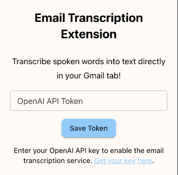
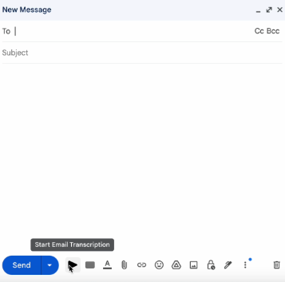

# Email Transcription Extension

## Description
The Email Transcription Extension is a Chrome extension designed to enhance productivity within Gmail. Using advanced speech-to-text technology, it helps users to transcribe spoken words directly into text in their Gmail compose window, allowing for a hands-free email-writing experience.

This particular application is optimized for identifying and accurately transcribing proper nouns, including names, locations, and other specific terms that are often challenging for standard speech recognition software.

## Features
- **Voice-to-Text Transcription:** Dictate your emails instead of typing, making email composition faster and more accessible.
- **Seamless Integration with Gmail:** Works directly within your Gmail compose window for a smooth user experience.
- **Advanced Transcription Accuracy:** Utilizes OpenAI Whisper speech recognition and GPT-4 for high-quality transcriptions.
- **Easy-to-Use Interface:** Simple and intuitive design, enabling users to start and stop transcriptions with the click of a button.
- **Secure and Private:** The extension does not store any voice data, ensuring user privacy.

## Installation
1. Clone the repository or download the ZIP file.
2. Unzip (if downloaded as a ZIP) and enter into the project directory in terminal.
3. Install the necessary dependencies within the folder by running `npm install`.
4. Download the final build version of the extension by running `npm run build`.
5. Navigate to `chrome://extensions/` in your Chrome browser.
6. Enable "Developer mode" at the top-right corner.
7. Click on "Load unpacked" and select the  `build` folder within the project's directory.
8. The extension should now appear in your extensions list and is ready for use.

## Usage and API Key Setup
1. **Setting Up The Extension:**
   - Once the extension is installed, click on the extension icon in the Chrome toolbar to open the popup window.
   - You will see an input field labeled "OpenAI API Token". Enter your OpenAI API key here. If you do not have an API key, see instructions below to obtain one.
   - Click the "Save Token" button to store your API key securely. Now, you can close the popup window.
   - Open your Gmail tab (or refresh your current tab) and click on the "Compose" button to start a new email.

2. **Starting a Transcription:**
   - Click on the "Start Email Transcription" button (start icon) in the bottom toolbar to begin recording your voice (visual below).
   - Speak clearly and directly into the microphone to dictate your email content.

3. **Stopping a Transcription:**
   - Once you've finished dictating, click on the "Stop Email Transcription" button (stop icon) in the bottom toolbar to end the recording.
   - The extension will process your audio and insert the transcribed text automatically into the compose window!

## Visual Guide
*API Key Popup Window* | *Transcription Button(s)*
:-------------------------:|:-------------------------:
 | 

## Best Practices for Using the Extension
- **Speak Clearly:** Ensure clear enunciation for best transcription results.
- **Email Format:** Try to speak in the format of an email. Start with a greeting, then the body, and close with a sign-off.
- **Paragraphs:** Pause slightly or use transition words like "moving on" or "furthermore" to indicate new paragraphs.
- **Background Noise:** Minimize background noise to improve transcription accuracy.
- **Editing:** Review the transcribed text for any errors or missing information before sending the email.

## Obtaining an OpenAI API Key
If you do not have an OpenAI API key, you can obtain one by:
1. Visiting [OpenAI's API platform](https://platform.openai.com/account/api-keys).
2. Signing up or logging in and following the instructions to create a new API key.
3. Copying the generated API key and pasting it into the extension's popup as described above.

## Notes
- Ensure your microphone is properly configured and allowed for use by the Chrome browser and GMail. You can enter into the extension settings to check and adjust your microphone permissions if this is an issue.
- The extension requires an active internet connection for transcription services.